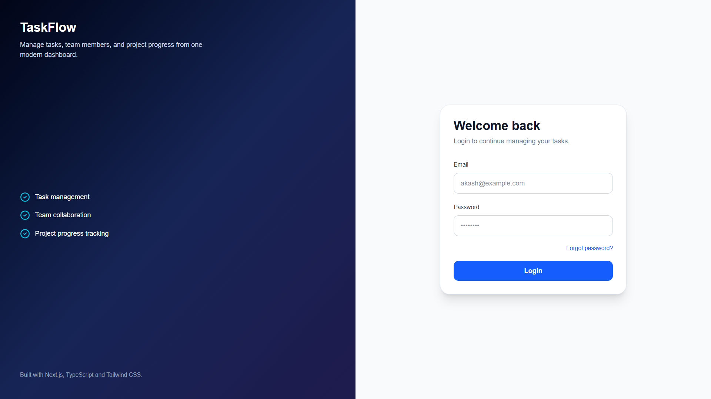
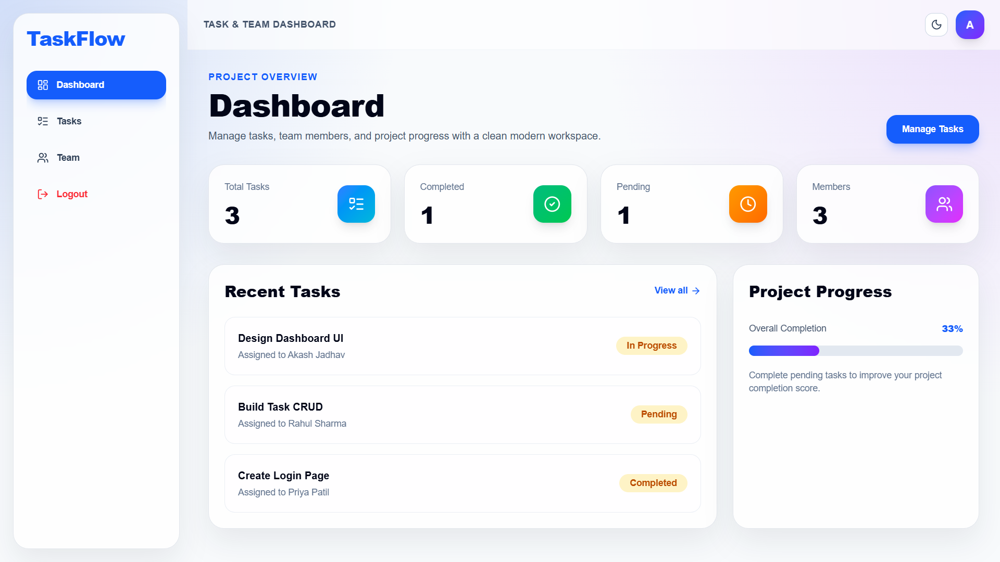
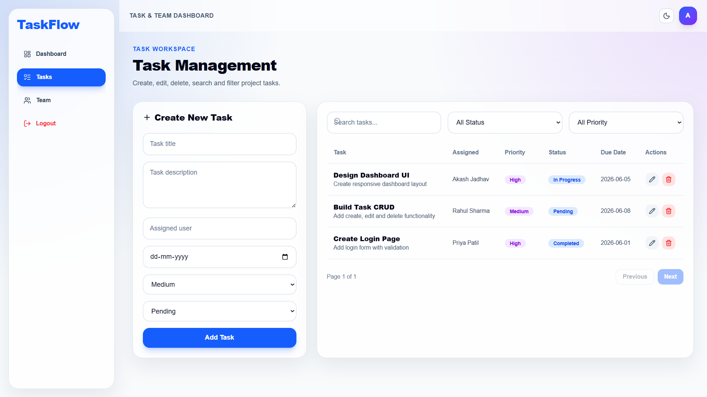
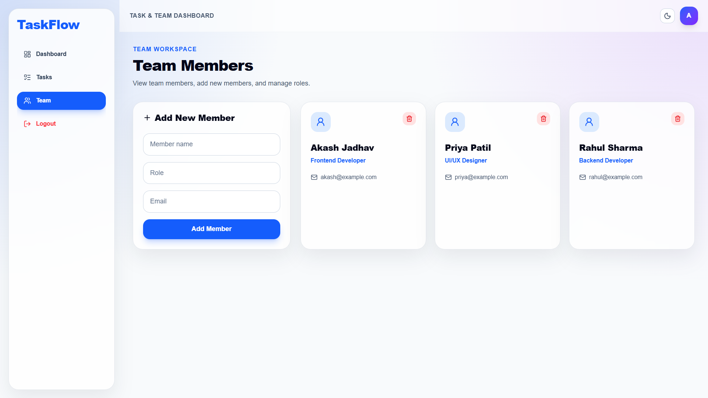
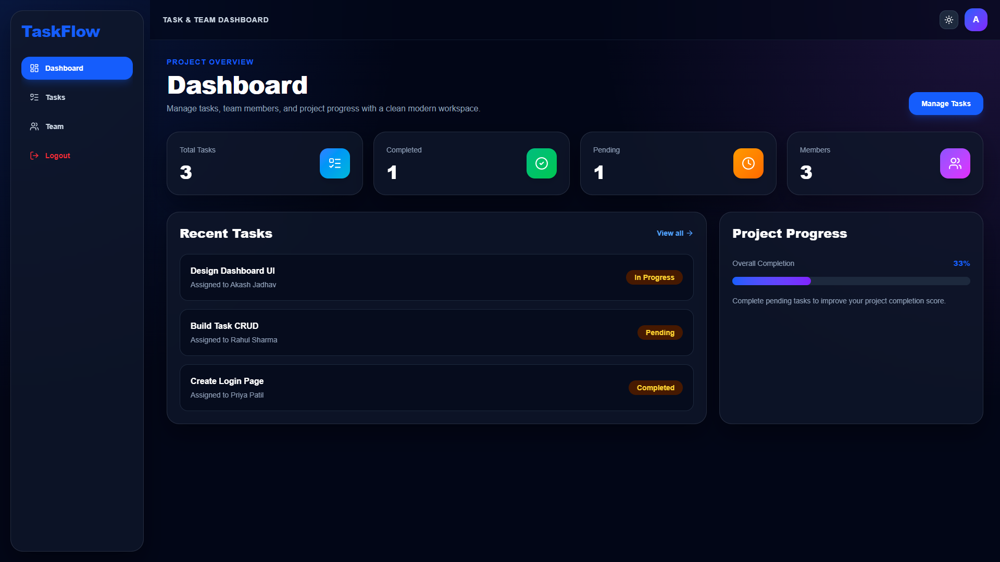

# 🚀 TaskFlow - Task & Team Management Dashboard

A modern, responsive Task & Team Management Dashboard built using **Next.js 15+, TypeScript, Tailwind CSS, and React Context API**.

This application helps teams manage tasks, monitor project progress, and organize team members through a clean and intuitive dashboard interface.

---

## 🌐 Live Demo

🔗 https://taskflow-dashboard-iota.vercel.app

---

## 📂 GitHub Repository

🔗 https://github.com/Akash-connect/taskflow-dashboard

---

## ✨ Features

### 🔐 Authentication UI
- Login Page
- Forgot Password Page
- Form Validation
- Responsive Authentication Layout

### 📊 Dashboard
- Total Tasks Overview
- Completed Tasks Count
- Pending Tasks Count
- Team Members Count
- Project Progress Tracking
- Recent Tasks Section

### ✅ Task Management
- Create New Tasks
- Edit Existing Tasks
- Delete Tasks
- Search Tasks
- Filter by Status
- Filter by Priority
- Pagination Support
- Task Assignment
- Due Date Management

### 👥 Team Management
- Add Team Members
- Delete Team Members
- View Team Information
- Role Management
- Email Information Display

### 🎨 UI/UX Features
- Modern Glassmorphism Design
- Dark / Light Theme Toggle
- Responsive Design
- Mobile Friendly Layout
- Interactive Components
- Active Sidebar Navigation
- Smooth User Experience

### 💾 Data Persistence
- Local Storage Integration
- Tasks Persist After Refresh
- Team Members Persist After Refresh

---

## 🛠️ Tech Stack

### Frontend
- Next.js
- React
- TypeScript
- Tailwind CSS

### State Management
- React Context API

### Icons
- Lucide React

### Deployment
- Vercel

---

## 📁 Project Structure

```bash
taskflow-dashboard/
│
├── app/
│   ├── dashboard/
│   ├── login/
│   ├── forgot-password/
│   ├── tasks/
│   ├── team/
│   ├── globals.css
│   └── layout.tsx
│
├── components/
│   ├── AppLayout.tsx
│   ├── AuthLayout.tsx
│   ├── ThemeToggle.tsx
│   └── ThemeProvider.tsx
│
├── context/
│   └── AppContext.tsx
│
├── data/
│   ├── tasks.ts
│   └── members.ts
│
├── types/
│   └── index.ts
│
├── public/
│
└── README.md
```

---

## ⚙️ Installation

### Clone Repository

```bash
git clone https://github.com/Akash-connect/taskflow-dashboard.git
```

### Navigate Into Project

```bash
cd taskflow-dashboard
```

### Install Dependencies

```bash
npm install
```

### Start Development Server

```bash
npm run dev
```

Open:

```bash
http://localhost:3000
```

---

## 📄 Available Pages

| Page | Route |
|--------|--------|
| Login | `/login` |
| Forgot Password | `/forgot-password` |
| Dashboard | `/dashboard` |
| Tasks | `/tasks` |
| Team Members | `/team` |

---

## 🎯 Assignment Requirements Covered

✅ Next.js with TypeScript

✅ Functional Components

✅ Responsive Design

✅ Reusable Components

✅ Task CRUD Operations

✅ Team Member Management

✅ Search & Filtering

✅ Context API State Management

✅ Form Validation

✅ Dark/Light Theme

✅ Pagination

✅ Local Storage Persistence

✅ Modern UI/UX

---

## 🚀 Deployment

Build Project:

```bash
npm run build
```

Deploy on Vercel:

```bash
vercel --prod
```

---

## 📸 Application Preview

### Login Page



### Dashboard



### Task Management



### Team Management



### Dark Mode



## 👨‍💻 Author

### Akash Jadhav

- GitHub: https://github.com/Akash-connect
- LinkedIn: https://www.linkedin.com/in/akash-jadhav-b728742b0

---

### Thank You 🙌

If you found this project helpful, feel free to star the repository.
